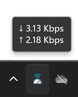

 NetSpeedTray
一个简单的网速监控工具，显示实时上传和下载速度。

## 功能特点

- 实时显示网络上传和下载速度
- 支持开机自启动
- 系统托盘显示，不占用任务栏
- 轻量级，资源占用少

## 截图

## 系统要求

- Windows 10/11
- .NET 6.0 或更高版本

## 安装使用

1. 从 [Releases](../../releases) 页面下载最新版本
2. 运行程序（需要管理员权限）
3. 程序会在系统托盘显示网速信息

## 设置说明

右键点击托盘图标可以：
- 设置开机自启动
- 退出程序 
